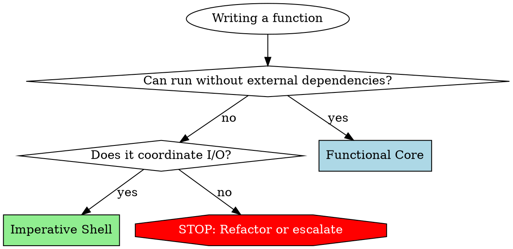

# Functional Core, Imperative Shell (FCIS)

## Overview

**Core principle:** Separate pure business logic and scientific algorithms (Functional Core) from side effects and I/O (Imperative Shell). Pure functions go in one file, I/O operations (file loading, database queries) in another.

**Why this matters:** Pure functions are trivial to test (no mocks needed) and essential for reproducible science. I/O code is isolated to thin shells. Bugs become structurally impossible when analysis logic has no side effects.

## When to Use

**Use FCIS when:**
- Writing any new code file
- Refactoring existing analysis pipelines
- Reviewing code for architectural decisions
- Deciding where logic belongs

**Trigger symptoms:**
- "Where should this filter function go?"
- Creating a new file for data processing
- Adding database calls to analysis logic
- Adding file I/O (HDF5/MAT) to calculations
- Writing tests that need complex mocking of the file system

## MANDATORY: File Classification

**YOU MUST add pattern comment to EVERY file you create or modify:**

```
# pattern: Functional Core
# pattern: Imperative Shell
# pattern: Mixed (needs refactoring)
```

**If file genuinely cannot be separated (rare), document why:**

```
# pattern: Mixed (unavoidable)
# Reason: [specific technical justification]
# Example: Performance-critical path where separating I/O causes unacceptable overhead in a real-time loop
```

**No file without classification.** If you create code without this comment, you have violated the requirement.

### Exceptions: Files That Don't Need Classification

**DO NOT add pattern comments to:**
- Bash/shell scripts (.sh, .bash) - inherently imperative
- Configuration files (.env, pyproject.toml, etc.)
- Markdown documentation (.md)
- Data files (JSON, YAML, CSV, etc.)

**Classification applies ONLY to application code** (source files containing business logic, analysis algorithms, or I/O orchestration).

## File Type Definitions

### Functional Core Files

**Contains ONLY:**
- Pure functions (same input -> same output, always)
- Analysis logic, signal processing, transformations, statistical tests
- Data structure operations (numpy/pandas manipulations)
- Logging (EXCEPTION: loggers are permitted in Functional Core)

**NEVER contains:**
- File I/O (reading/writing .mat, .h5, .csv files)
- Database operations (queries, updates, connections)
- Network requests
- Environment variable access
- `datetime.now()`, `np.random.rand()`, or other non-deterministic functions
- State mutations outside function scope

**Logging exception:** Functions MAY accept and use loggers. For unit tests, pass no-op loggers. This is the ONLY permitted side effect in Functional Core.

**Test signature:** Simple assertions, no mocks except logger (if used).

### Imperative Shell Files

**Contains ONLY:**
- I/O operations: file system (loading datasets), database, environment
- Orchestration: load data -> call Functional Core analysis -> save results
- Error handling for I/O failures (file not found, corrupted data)
- Minimal logic (coordination only)

**NEVER contains:**
- Complex analysis algorithms
- Signal processing logic
- Statistical calculations beyond simple aggregation for reporting

**Test signature:** Integration tests with real data files or test doubles.

## Code Flow Pattern

```
1. GATHER (Shell):  Load signal data from HDF5/MAT files
2. PROCESS (Core):  Apply filter, detect spikes, calculate metrics (pure)
3. PERSIST (Shell): Save processed results to database or new file
```

**Every operation follows this sequence.** No exceptions.

## Decision Framework

Before writing a function, ask:



**Questions to ask:**
- Can this logic run without file system, database, network, or environment?
  - **YES** -> Functional Core
  - **NO** -> Does it coordinate I/O or contain analysis logic?
    - **I/O coordination** -> Imperative Shell
    - **Analysis logic + I/O** -> STOP. Refactor or escalate to user.

## Common Mistakes and Rationalizations

| Excuse/Thought Pattern | Reality | What To Do |
|------------------------|---------|------------|
| "Just one file read in this calculation" | File I/O = side effect. Not Functional Core. | Extract to Shell. Pass data as parameter. |
| "Database is passed as parameter, so it's pure" | Database operations are I/O. Not pure. | Move to Shell. Core receives data, not DB connection. |
| "This validation needs to check if data file exists" | File system check = I/O. Not Functional Core. | Shell checks file, passes boolean to Core validation. |
| "Need random seed for simulation" | Non-deterministic. Not pure. | Shell passes seed or random generator state as parameter. |
| "Logging is a side effect, should remove" | **WRONG.** Logging is explicitly permitted. | Keep logger. This is the exception. |
| "Performance requires mixing" | Prove it with benchmarks. Usually wrong. | Separate first. Optimize with evidence. Mark Mixed (unavoidable) with justification. |

## Red Flags - STOP and Refactor

If you catch yourself doing ANY of these, STOP:

- **File I/O in an analysis function** (`h5py.File`, `scipy.io.loadmat`)
- **Database passed as parameter to Functional Core** (queries, updates, connections)
- **Environment variables in calculations** (e.g., setting paths inside a filter)
- **`np.random.seed()` inside a pure algorithm**
- **Creating a file without pattern classification comment**
- **Thinking "just this once" about mixing concerns**

**All of these mean:** Extract I/O to Shell. Pass data to Core. Classify file correctly.

## Implementation Patterns

### Functional Core Pattern

```python
# pattern: Functional Core
import numpy as np

def detect_threshold_crossings(signal, threshold, logger=None):
    """Pure algorithm: same signal and threshold always produce same output."""
    if logger:
        logger.debug(f"Processing signal with shape {signal.shape}")

    # Pure numpy logic
    crossings = np.where(signal > threshold)[0]
    
    if logger and len(crossings) > 0:
        logger.info(f"Detected {len(crossings)} crossings")

    return crossings
```

**No I/O. No database. No file system. Only computation.**

### Imperative Shell Pattern

```python
# pattern: Imperative Shell
import h5py

def process_session_data(file_path, threshold, db, logger):
    """Orchestrates: gather -> process -> persist."""

    # GATHER: Load data from HDF5 file
    with h5py.File(file_path, 'r') as f:
        signal = f['raw_signal'][:]

    # PROCESS: Call Functional Core (pure logic)
    crossings = detect_threshold_crossings(signal, threshold, logger)

    # PERSIST: Save results to database
    db.save_crossings(file_path, crossings)

    return crossings
```

**Shell is thin. Core does heavy lifting. Testable separately.**

## Summary

**FCIS in three rules:**

1. **Functional Core:** Pure functions only. No I/O except logging. Easy to test and reproduce.
2. **Imperative Shell:** I/O coordination only. Minimal logic. Calls Core.
3. **Classify every file.** No exceptions. No files without pattern comments.
